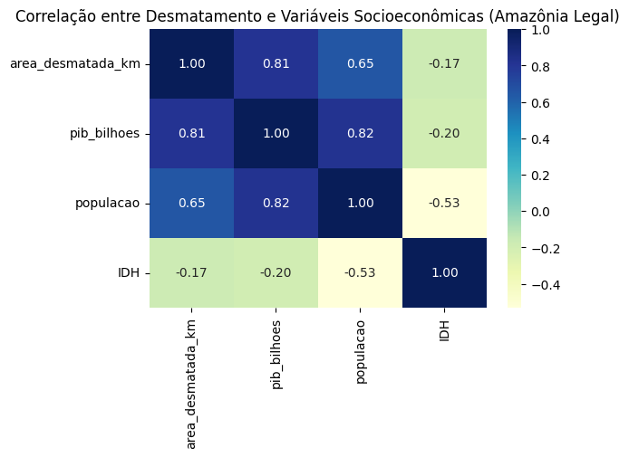
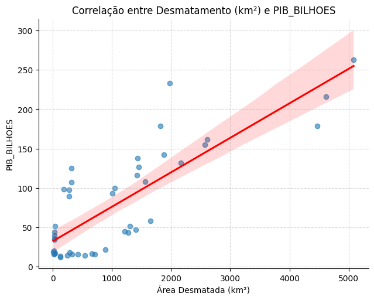
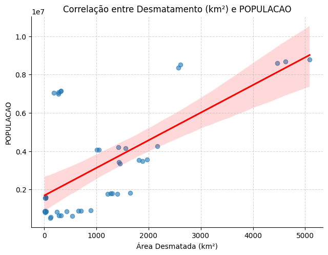
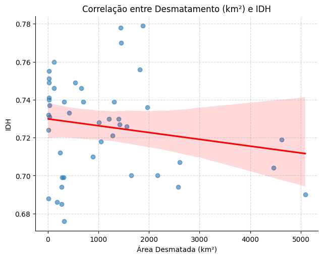

# 🌎 ZettaLab — Análise dos Impactos Socioeconômicos na Amazônia Legal

## 🧭 Contexto

Este projeto foi desenvolvido como parte do **Desafio I — Ciência e Governança de Dados**, cujo objetivo é responder à pergunta:

> **Como poderíamos avaliar e prever/visualizar os agentes e fenômenos que mais causam impactos socioeconômicos no Brasil?**

A pesquisa concentra-se na **Amazônia Legal**, região que abrange nove estados brasileiros (AC, AM, AP, MA, MT, PA, RO, RR e TO). O estudo explora a relação entre **desmatamento**, **PIB**, **população** e **IDH** no período de **2017 a 2021**, utilizando dados públicos do **INPE/PRODES**, **IBGE** e **IPEA**.

---

## 🧩 Estrutura e Metodologia

O projeto foi dividido em quatro grandes etapas:

### 1. Aquisição e limpeza de dados

* Conversão do shapefile do PRODES para CSV e soma da área desmatada por estado.
* Agregação dos dados populacionais e de PIB do IBGE por estado e ano.
* Conversão da tabela de IDH (IPEA) para formato longo (UF, ano, IDH).
* Integração de todas as bases em um único arquivo: `base_final.csv`.

### 2. Análise exploratória

* Verificação de correlações entre variáveis (PIB, população, IDH, desmatamento).
* Criação de gráficos de dispersão e heatmaps para identificar padrões e relações.
* Conversão de tipos e padronização de colunas.

### 3. Modelagem estatística e preditiva

* Aplicação de **regressão linear multivariada** .
* Geração de previsões de PIB e IDH até 2024 com base nas tendências observadas e no desmatamento dos anos posteriores.
* Interpretação dos coeficientes e validação visual dos resultados.

### 4. Visualização e comunicação dos resultados

* Produção de gráficos explicativos para correlação e regressão.
* Criação de notebook explicativo (`ZettaLab_Analise_Amazonia.ipynb`) com comentários e estrutura organizada.

---

## 📚 Bases de Dados

Abaixo estão descritas as bases de dados utilizadas e o significado de suas principais colunas para facilitar a compreensão e reprodutibilidade da análise.

### 🏞️ Desmatamento — `desmatamento_2017-2021.csv`

* **fid**: identificador único da feição no shapefile original do PRODES.
* **state**: sigla do estado (UF) pertencente à Amazônia Legal.
* **image_date**: data da imagem de satélite usada para detecção do desmatamento.
* **area_km**: área total desmatada em quilômetros quadrados.

### 👥 População — `br_ibge_populacao_municipio.csv`

* **UF**: sigla do estado.
* **municipio**: nome do município.
* **populacao**: número total de habitantes estimado pelo IBGE.
* **ano**: ano de referência da estimativa.

### 💰 PIB — `pib_municipal_2017.csv` a `pib_municipal_2021.csv`

* **UF**: sigla do estado.
* **municipio**: nome do município.
* **pib_mil_reais**: valor do PIB municipal em milhares de reais.
* **pib_bilhoes**: valor do PIB convertido para bilhões de reais.
* **ano**: ano de referência dos dados.

### 📈 IDH — `ipeadata_idh_2017-2021.csv`

* **UF**: sigla do estado.
* **ano**: ano de referência.
* **IDH**: Índice de Desenvolvimento Humano — indicador que varia de 0 a 1, medindo o desenvolvimento em renda, longevidade e educação.

### 🧩 Base Final — `base_final_analise.csv`

* **UF**: sigla do estado da Amazônia Legal.
* **ano**: ano de referência (2017–2021).
* **populacao**: número total de habitantes.
* **area_km**: área desmatada no respectivo ano (km²).
* **IDH**: índice de desenvolvimento humano do estado.
* **pib_mil_reais**: PIB estadual em milhares de reais.
* **pib_bilhoes**: PIB estadual em bilhões de reais.

| Fonte         | Descrição                                         | Período   | Caminho                                           |
| ------------- | ------------------------------------------------- | --------- | ------------------------------------------------- |
| INPE / PRODES | Desmatamento anual por estado (área em km²)       | 2017–2021 | `data/limpos/desmatamento_2017-2021.csv`          |
| IBGE          | População estimada por estado                     | 2017–2021 | `data/limpos/populacao_estadual_2017-2021.csv`    |
| IBGE          | PIB estadual (em milhões e bilhões de reais)      | 2017–2021 | `data/limpos/pib_estadual_amazonia_2017_2021.csv` |
| IPEA          | Índice de Desenvolvimento Humano (IDH)            | 2017–2021 | `data/limpos/ipeadata_idh_2017-2021.csv`          |
| ZettaLab      | Base final unificada (9 UFs × 5 anos = 45 linhas) | 2017–2021 | `data/limpos/base_final.csv`                      |

---

## 📊 Resultados e Visualizações

A seguir, os principais gráficos gerados e suas interpretações:

### 🔥 Heatmap de Correlação

> Mostra correlação **forte e positiva** entre **PIB**, **população** e **desmatamento**, enquanto o **IDH** apresenta correlação **fraca e levemente negativa** com o desmatamento.

### 💰 Desmatamento × PIB

> Relação **positiva**: quanto maior a área desmatada, maior tende a ser o PIB. Indica possível dependência econômica de atividades que exploram o território.

### 👥 Desmatamento × População

> Relação **positiva**: estados mais populosos apresentam maior área desmatada, o que pode refletir expansão urbana e agrícola.

### 🌱 Desmatamento × IDH

> Relação **negativa**: maiores níveis de desmatamento estão associados a **menor IDH**, indicando que o crescimento econômico e populacional **não tem se traduzido em desenvolvimento humano proporcional**.

---

## 🧠 Principais Insights

* **O desmatamento cresce junto com o PIB e a população**, evidenciando um modelo econômico baseado em expansão territorial.
* **O IDH diminui levemente** com o aumento do desmatamento, sugerindo que o progresso econômico **não tem refletido igualmente em bem-estar social**.
* As relações encontradas indicam que políticas públicas devem equilibrar **crescimento econômico e conservação ambiental**.

### ⚠️ Implicações e Problemas Potenciais

* O aumento simultâneo de PIB e desmatamento pode representar **crescimento econômico insustentável**, dependente da exploração de recursos naturais e da expansão agrícola.
* Esse padrão pode agravar **perdas de biodiversidade**, **degradação do solo** e **emissões de carbono**, comprometendo compromissos ambientais nacionais e internacionais.
* Em termos sociais, a desigualdade tende a crescer: áreas com forte expansão econômica podem concentrar renda, enquanto populações locais e indígenas sofrem deslocamentos e perda de recursos ambientais.
* A redução no IDH em regiões de maior desmatamento sugere **fragilidade nos investimentos em saúde, educação e infraestrutura**, mesmo em contextos de aumento de riqueza.
* Esses resultados destacam a urgência de políticas que conciliem **preservação ambiental, diversificação econômica e inclusão social** na Amazônia Legal.

---

### 🔮 Insights das Previsões (2022–2024)

Com base nos dados reais e projetados de desmatamento, foram estimados os valores de **PIB** e **IDH** para o período de 2022 a 2024.

Os resultados do arquivo `previsoes_desmatamento_base.csv` indicam que:

- **O PIB tende a continuar crescendo**, acompanhando o aumento do desmatamento, o que reforça o padrão de dependência econômica de atividades extrativistas e agropecuárias.
- **O IDH apresenta tendência de estagnação ou leve queda** em estados com maior avanço do desmatamento, sinalizando que o crescimento econômico **não está sendo acompanhado por melhorias sociais e educacionais**.
- Em estados com **menor desmatamento recente**, observa-se **crescimento econômico mais estável** e **IDH mais consistente**, sugerindo um modelo de desenvolvimento menos dependente da expansão territorial.
- Se as tendências atuais persistirem, a Amazônia Legal pode enfrentar **aumento das desigualdades regionais**, **pressão sobre ecossistemas** e **redução da qualidade de vida** em áreas de intensa exploração ambiental.

Essas previsões reforçam a necessidade de políticas públicas voltadas à **diversificação econômica, monitoramento ambiental e investimento em capital humano** para que o crescimento econômico seja sustentável no longo prazo.

---

## 📈 Conclusão e Próximos Passos

Os resultados mostram que o desmatamento é um **agente central de impacto socioeconômico** na Amazônia Legal. A expansão econômica observada entre 2017 e 2021 vem acompanhada de degradação ambiental e ganhos sociais limitados.

---

## 🔗 Fontes (links oficiais)

* **Desmatamento por estado (PRODES/INPE)**: [https://terrabrasilis.dpi.inpe.br/downloads/](https://terrabrasilis.dpi.inpe.br/downloads/)
* **PIB municipal 2021 (IBGE / SIDRA 5938)**: [https://apisidra.ibge.gov.br/values/t/5938/n6/all/v/37/p/2021](https://apisidra.ibge.gov.br/values/t/5938/n6/all/v/37/p/2021)
* **População municipal (Base dos Dados / IBGE)**: [https://basedosdados.org/dataset/d30222ad-7a5c-4778-a1ec-f0785371d1ca?table=0c279444-165b-41da-92cd-50fd7e66baa1](https://basedosdados.org/dataset/d30222ad-7a5c-4778-a1ec-f0785371d1ca?table=0c279444-165b-41da-92cd-50fd7e66baa1)
* **IDH (IPEAData)**: [https://www.ipeadata.gov.br/Default.aspx](https://www.ipeadata.gov.br/Default.aspx)

## ⚙️ Tecnologias Utilizadas

* **Python 3.11**
* **pandas, geopandas** — manipulação e integração de dados
* **matplotlib, seaborn** — visualização
* **scikit-learn** — modelagem e regressão
* **Jupyter Notebook** — documentação e reprodutibilidade

---

## 👩‍💻 Autoria

**Desenvolvido por Arthur Soares Marques**

Este trabalho foi desenvolvido no contexto do Desafio I — 2025.

📂 Repositório: `https://github.com/ArthurDp78/Desafio1-ZettaLab-CienciaGovernancaDados`

---
